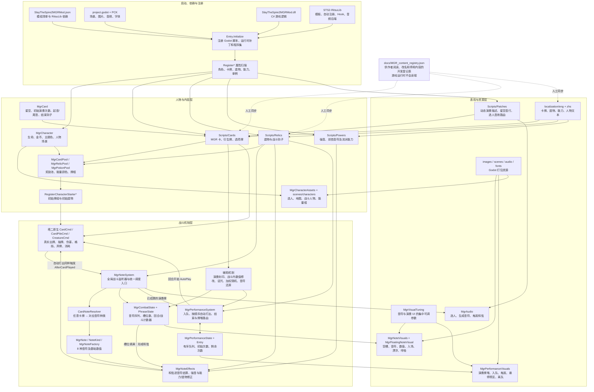
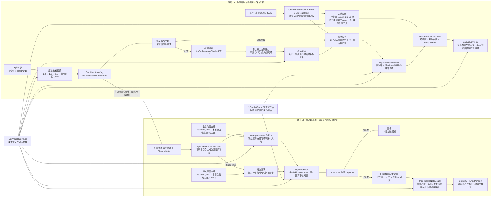

# MGR 模组架构图

本文用于两个不同视角：第一张图回答“整个模组由什么组成、一次出牌会经过哪里”；第二张图只展开音符与演奏 UI，供后续定位动画与调整参数。

## 图一：整个模组

### 阅读与检查顺序

1. 启动失败或内容没注册：先看 `Entry.cs`、模组清单、`Register*` 属性和 RitsuLib 版本。
2. 人物、卡池或初始配置不对：看 `Scripts/Characters`，再看卡牌/遗物上的注册属性。
3. 出牌、音符、和弦异常：从 `MgrNoteSystem.cs` 沿着 `CardNoteResolver.cs`、`MgrCombatState.cs`、`MgrNoteEffects.cs` 检查。
4. 演奏入队、触发或结算异常：看 `MgrPerformanceSystem.cs`、`MgrPerformanceState.cs`、`MgrPerformanceEntry.cs`。
5. 机制正常但画面异常：只看第二张图中的表现层；不要先改状态层。

## 图二：音符与演奏 UI / 动画

### UI 调参入口

集中参数都在 `Scripts/Mechanics/MgrVisualTuning.cs`。更细的颜色、标签、层级和节点结构仍在各自的表现文件中。

| 想调整的东西 | 优先修改 | 当前关键值 |
| --- | --- | --- |
| 音符整排位置、大小、间距 | `Notes.RackOffset / ArtworkScale / DesiredSlotSpacing / MaximumRackWidth` | `(0,-350)`、`0.76`、`96`、`480` |
| 空槽外观 | `SlotRadius / EmptySlotDashCount / EmptySlotDashFill / EmptySlotDashWidth` | `30`、`8`、`0.48`、`2.5` |
| 单颗音符入场 | `FirstNoteEntranceSeconds / MinimumNoteEntranceSeconds / Entrance*` | 首颗 `0.28s`，最低 `0.10s`，起始缩放 `0.28`，过冲 `1.18` |
| 多音符生成加速 | `NoteEntranceAccelerationPerNote` | 本回合每已有一颗减 `0.018s` |
| 和弦满槽停留 | `FirstChordHoldSeconds / MinimumChordHoldSeconds / ChordHoldAccelerationPerChord` | `0.42s` → 最低 `0.12s`，每次减 `0.05s` |
| 音符漂浮与呼吸差异 | `Bob* / Breath* / InitialScaleVariance / PhaseVariance` | 上下 `5px`；缩放约 `±5.5%`；速度随机约 `±20%` |
| 演奏牌整排位置、大小、重叠 | `Performances.RackOffset / MiniatureScale / DesiredSpacing / MaximumWidth` | `(0,-500)`、`0.33`、`52`、`520` |
| 演奏牌入队 | `EnterQueueSeconds` | `0.28s` |
| 演奏触发跳动 | `TriggerScale / TriggerGrowSeconds / TriggerSettleSeconds` | `1.2`、`0.14s`、`0.18s` |
| 演奏结束离队 | `ExitSeconds` | `0.38s` |
| 悬停详情大小与位置 | `PreviewScale / PreviewGrowSeconds / PreviewMouseXOffset` | `0.8`、`0.12s`、鼠标右侧 `34px` |

完整的逐项说明见 `docs/MGR视觉特效参数表.md`。

### 表现层文件边界

| 文件 | 只负责什么 |
| --- | --- |
| `MgrVisualTuning.cs` | 集中参数，不处理战斗规则 |
| `MgrNoteVisuals.cs` | 音符槽、入场、数值、清空与布局 |
| `MgrFloatingNoteVisual.cs` | 单颗音符持续的漂浮、呼吸和随机差异 |
| `MgrPerformanceVisuals.cs` | 演奏牌入队、重叠、触发、悬停、离队 |
| `MgrNoteSystem.cs` | 决定何时播放音符/和弦表现，并提供动画加速计数 |
| `MgrPerformanceSystem.cs` | 决定何时入队、触发和结束；表现层不修改这些规则 |
