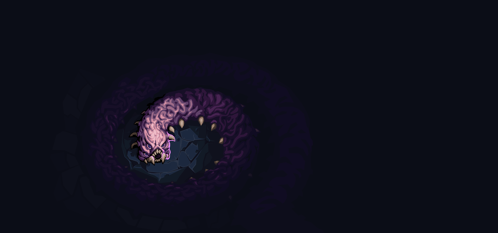
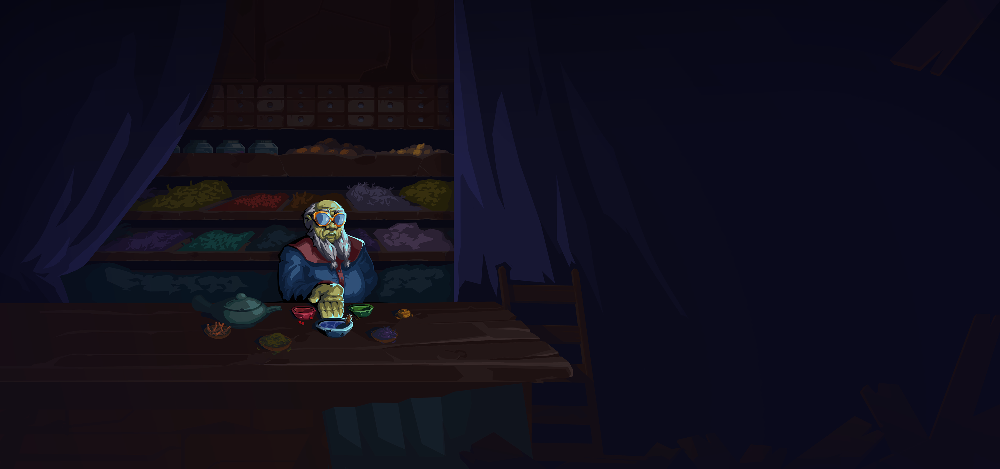
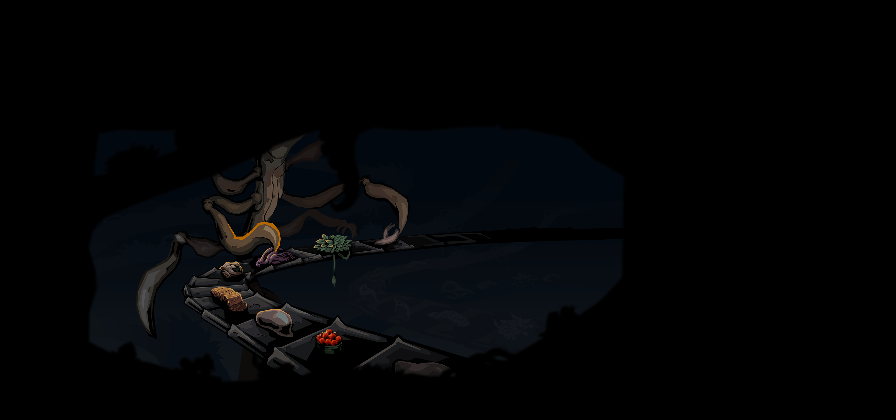
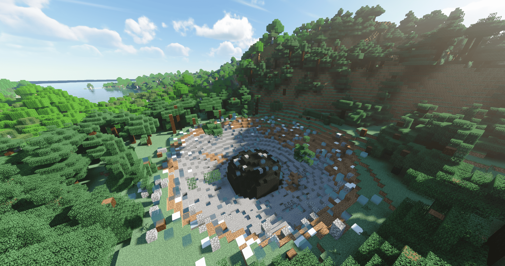

# 事件实现与图片参考

本目录用于两类只读参考：

1. 盘点工作区其他角色模组实际添加或替换的事件及其出现条件。
2. 保存少量原版与其他模组事件图片的原始副本，用于观察画布尺寸、格式、主体位置和文本安全区。

这些图片不属于 MGR 运行时资源，不得直接打入 `MGRMod.pck`；其他模组和原版图片仅供内部研究，不代表获得了重新发布或改作授权。

## 一、其他角色模组事件盘点

### 忍者模组：4 个普通事件

| 事件 | 注册或触发方式 | 实际出现条件 |
|---|---|---|
| 尾立，微辣，未来 | `Overgrowth`、`Underdocks` | 第一幕两张地图；没有额外 `IsAllowed` 条件。 |
| 伟大封印 | `Glory` | 第三幕；生命高于 15 的限制已经被注释，当前没有额外条件。 |
| 渴了 | `[RegisterSharedEvent]` | 所有章节；所有玩家都必须拥有超过 10 张可移除卡牌，即至少 11 张。这里只是跨章节注册，事件本身没有 `IsShared => true`。 |
| 鳗鱼店 | `Hive` | 第二幕；所有玩家都必须至少拥有 220 金币。事件会进入战斗，因此设置了 `IsShared => true`。 |

源码入口：[`忍者模组/LexNinja2Code/Event`](../../../../忍者模组/LexNinja2Code/Event)。没有发现额外的强制事件 Hook 或远古事件注册。

### 狐狸模组：3 个普通随机事件 + 1 个任务强制事件

| 事件 | 注册或触发方式 | 实际出现条件 |
|---|---|---|
| 沙漠神殿 | `Overgrowth`、`Underdocks` | 第一幕两张地图；狐狸模组的“启用事件”设置必须开启，除此之外没有条件。 |
| 天外陨石 | `Overgrowth`、`Underdocks` | 第一幕两张地图；“启用事件”设置必须开启，除此之外没有条件。 |
| 隐世樱花林 | `Overgrowth`、`Underdocks` | 第一幕两张地图；“启用事件”设置开启，并且所有玩家牌组中都没有“寻风之铃”。这是多人共享事件。 |
| 隐世之境 | `[RegisterSharedEvent]`，但 `IsAllowed` 恒为 `false` | 不会从普通事件池随机出现。任意仍参与 Hook 的玩家携带“寻风之铃”，且铃的 `TargetActIndex <= CurrentActIndex` 时，下一个问号房会被强制判定为事件房并替换为本事件。正常流程下铃在获得时把目标设为下一幕，因此通常从下一幕开始触发。这个强制 Hook 没有读取“启用事件”设置。 |

源码入口：[`狐狸模组/Events`](../../../../狐狸模组/Events)。狐狸模组的事件开关默认值为 `true`。

### 魔理沙模组：1 个原版事件替换

| 事件 | 注册或触发方式 | 实际出现条件 |
|---|---|---|
| 蘑菇饥渴 | 自定义事件自身 `IsAllowed` 恒为 `false`，不进入普通事件池 | 第三幕原版“蘑菇饥渴”被选中时，如果相关玩家持有初始遗物“迷你八卦炉”或其升级“妖异八卦炉”，遗物的 `ModifyNextEvent` 会把原版事件替换成魔理沙版本。 |

源码入口：[HungryForMushroomsMarisa.cs](../../../../魔理沙模组/Scripts/Events/HungryForMushroomsMarisa.cs)、[MiniHakkero.cs](../../../../魔理沙模组/Scripts/Relics/MiniHakkero.cs) 和 [BewitchedHakkero.cs](../../../../魔理沙模组/Scripts/Relics/BewitchedHakkero.cs)。源码引用了 `marisamod/images/events/hungry_for_mushrooms.png`，但当前工作区没有这张实际 PNG，因此本目录没有复制魔理沙图片。

### 未发现事件实现的目录

- `工匠模组/`：没有发现 `EventModel`、`ModEventTemplate`、事件注册特性或事件替换 Hook。
- `CVC/`：只有跨版本兼容配置中提到原版 `EventModel` 方法，不是角色事件内容。
- `储君特效模组参考/`：没有发现玩法事件注册；出现的 `FmodEventHandle` 是音频事件句柄，与地图事件无关。

## 二、原版图片规格结论

对 [`塔2原版资源参考/images/events`](../../../../塔2原版资源参考/images/events) 顶层 59 张 PNG 的统计结果：

- 57 张标准完整事件图均为 **3440 × 1616、PNG、RGBA**。
- 另外两张是特殊用途的前景层和遮罩，不是普通事件主图。
- 标准画布宽高比约为 **2.129:1**。
- 原版文件虽然保存为 RGBA，但抽查的普通事件图 Alpha 全部为 255；因此允许完全不透明，透明背景不是要求。
- 默认事件布局中的 `Portrait` 显示区域为 **2560 × 1200**，使用保持宽高比的居中缩放，并额外放大到 `1.04`。3440 × 1616 与该区域比例几乎一致，只会产生非常轻微的边缘裁切。

### MGR 新事件图推荐规范

| 项目 | 推荐值 | 原因 |
|---|---|---|
| 画布 | **3440 × 1616** | 与原版完整事件主图一致。 |
| 格式 | **PNG** | 原版和已检查模组事件资源均使用 PNG，避免 JPEG 压缩噪点。 |
| 色彩通道 | **8-bit RGBA** | 与原版资源结构一致；不需要透明时 Alpha 可全为 255。 |
| 宽高比 | **约 2.129:1** | 匹配默认 `2560 × 1200` 事件展示区域。 |
| 导入文件 | 只提交 `.png` | `.import` 由 Godot 自动生成，不应手工复制或维护。 |

构图建议：

- 主要人物、怪物或物件尽量位于画面左半边或中间偏左。
- 右侧中央留出低对比、低细节的文本安全区；默认标题与描述容器宽约 800 像素，位于画面中央偏右。
- 不要把脸、关键道具或文字贴在画布边缘。默认主图还会整体放大约 4%，建议四周至少保留约 2% 至 4% 的非关键区域。
- 背景可以铺满画布；RGBA 不等于必须透明。原版通常以暗背景、左侧主体、右侧留白保证正文可读性。
- 狐狸模组的 2560 × 1351 图片可以正常导入，但宽高比约 1.895:1，与原版布局不一致，只适合作为“游戏能够接受其他尺寸”的例子，不应当作为 MGR 制图模板。

## 三、所选图片清单

| 来源 | 文件 | 尺寸 | PNG 模式 | 用途 |
|---|---|---:|---|---|
| 原版 | [brain_leech.png](原版/brain_leech.png) | 3440 × 1616 | RGBA | 标准暗背景、主体偏左。 |
| 原版 | [crystal_sphere.png](原版/crystal_sphere.png) | 3440 × 1616 | RGBA | 标准尺寸的亮色/魔法题材。 |
| 原版 | [hungry_for_mushrooms.png](原版/hungry_for_mushrooms.png) | 3440 × 1616 | RGBA | 可与魔理沙的原版事件替换逻辑对照。 |
| 原版 | [tea_master.png](原版/tea_master.png) | 3440 × 1616 | RGBA | 非常清楚的“左侧主体、右侧正文安全区”例子。 |
| 忍者模组 | [ManYuDian.png](忍者模组/ManYuDian.png) | 3440 × 1616 | RGBA | 完全符合原版画布尺寸。 |
| 忍者模组 | [Drink.png](忍者模组/Drink.png) | 3440 × 1613 | RGBA | 与标准高度仅差 3 像素，可观察近似规格的兼容表现。 |
| 狐狸模组 | [celestial_meteorite.png](狐狸模组/celestial_meteorite.png) | 2560 × 1351 | 调色板 PNG | 非标准宽高比和非 RGBA 模式的兼容例子。 |
| 狐狸模组 | [desert_pyramid.png](狐狸模组/desert_pyramid.png) | 2560 × 1351 | RGBA | 非标准宽高比但使用 RGBA 的对照例子。 |

## 四、快速预览

### 原版：脑蛭

### 原版：茶艺大师

### 忍者模组：鳗鱼店

### 狐狸模组：天外陨石

