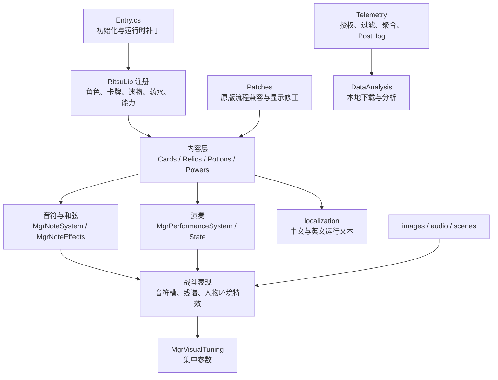

# MGR 模组架构与开发检查

本文是仓库总入口：说明模组由什么组成、问题应从哪里定位，以及完成修改后需要检查什么。具体卡牌登记见 `MGR_content_registry.json`，卡池设计见 `MGR卡池设计与分析.md`，视觉实现见 `MGR视觉与特效登记.md`。

## 一、发布物与依赖

MGR 发布时只需要模组 DLL、PCK 和清单；依赖 RitsuLib，游戏与双方联机环境应使用兼容版本。`docs` 与 `DataAnalysis` 是开发辅助目录，已由 `.gdignore`、导出过滤和项目编译规则排除，不进入 PCK。

本地开发约定：只进行编译检查，不自动部署到游戏目录，不自动推送 GitHub。项目根目录 `.artifacts/` 和所有生成的 `.pck` 都是可重建的本地产物，必须由 `.gitignore` 排除；Git 只保存源码、构建脚本与发布结构定义，不保存实际发布包。

## 二、整体结构



## 三、目录职责

| 路径 | 职责 | 常见问题 |
|---|---|---|
| `Scripts/Entry.cs` | 模组初始化、补丁和遥测注册 | 模组整体不加载、补丁未应用 |
| `Scripts/Characters` | 人物模型、初始卡组、金币、主题色与资源入口 | 选人、战斗人物、初始内容错误 |
| `Scripts/Cards` | 卡牌逻辑、动态值、升级和特定动画调用 | 单卡效果、描述数字、升级错误 |
| `Scripts/Relics` | 遗物、计数、跨战斗状态与奖励限制 | 计数不同步、触发时机错误 |
| `Scripts/Potions` | MGR 专属药水 | 药水池、边框和效果错误 |
| `Scripts/Powers` | 持续能力与触发钩子 | 回合时机、叠层、能力描述错误 |
| `Scripts/Mechanics` | 音符、和弦、演奏、选牌、随机池、UI 和特效公共逻辑 | 跨卡牌系统性问题 |
| `Scripts/Patches` | 对原版与 RitsuLib 流程的最小兼容补丁 | 层级、卡牌描述、跨角色卡池问题 |
| `Scripts/Telemetry` | 单人对局统计、隐私过滤、限流和数据清洗 | 不应影响正常游戏流程 |
| `MGRMod/localization` | 游戏真正读取的本地化 | 缺键、变量显示、关键词顺序错误 |
| `MGRMod/images` | 卡图、遗物、人物、音符、药水与 VFX 资源 | UID、导入、尺寸和引用错误 |
| `MGRMod/scenes` | Godot 场景与 UI 节点 | 层级、锚点、缩放错误 |
| `docs` | 长期维护文档与内容登记 | 不参与运行与打包 |
| `DataAnalysis` | PostHog 下载脚本和本地数据 | `Data/` 被 Git 忽略，不参与打包 |

## 四、核心机制边界

### 音符与和弦

- 所有牌按统一解析器映射为音符，特殊 MGR 类型只在统一入口覆盖。
- 生成音符只修改战斗状态；UI 是状态的镜像，不得反过来决定效果。
- 音符槽容量可变。起音、尾音必须根据实时容量判断，不能写死为四槽。
- 和弦计数和结算必须经过统一入口，额外触发仍应正确记录。
- 权重随机、禁止生成攻击音符等规则在统一音符池处理，卡牌不重复实现。
- 终止剩余音符时必须沿用原版“存活主要敌人 + `ShouldStopCombatFromEnding`”语义，不能把所有 `IsDead` 都当作最终清场；实验体及其他复活机制会在阶段转换时短暂死亡。
- “关闭音符音效”是本机全局表现设置，开关默认关闭、玩家手动开启后静音，不进入战斗状态或联机协议；MGR Bank 继续走 `bus:/master/sfx`，不要在调用点重复套用原版主音量或音效音量。

### 演奏

- 演奏是独立有序状态；最早进入者先结算。
- 自动演奏仍属于真实出牌，因此会生成音符并触发正常卡牌效果。
- 通过其他卡牌直接入队时：本身有演奏就使用自身次数，本身没有则显示并使用演奏 1。
- 演奏结束必须走原版牌堆路由，不能直接塞入集合，否则弃牌堆计数和动画会失真。
- 牌面、悬停命中、触发光效和剩余次数必须共享同一套坐标来源。
- 不要轻易改动已经稳定的入队、触发、悬停与离队主链；新增表现应挂在公开视觉钩子上。

### 卡牌和内容登记

- `MGR_content_registry.json` 是开发检索表，不由游戏运行时读取。
- 修改 `name`：同步中文本地化。
- 修改 `codeName`：同步类型、源码文件、图片、注册键和本地化键。
- 开发阶段不兼容旧测试存档；正式发布后再冻结注册主键。
- 卡牌描述遵循 `CARD_DESCRIPTION_STYLE_GUIDE.md`。

## 五、定位顺序

1. **无法启动或构建失败**：清单、RitsuLib 版本、`Entry.cs`、编译日志。
2. **内容没出现**：注册属性、角色卡池、`MGR_content_registry.json`、图片与本地化键。
3. **单卡效果错误**：对应卡牌类及其调用的 Power/Mechanics，不先修改全局系统。
4. **多张牌共同出错**：统一解析器、音符系统、演奏系统、牌堆命令或补丁。
5. **机制正确但显示错误**：Visual、场景、Canvas/ZIndex、`MgrVisualTuning`。
6. **地图、详情、药水弹窗层级错误**：Overlay/Capstone 可见性与层级补丁，不用简单隐藏整个 UI 代替遮挡。

## 六、每次修改后的检查

### 静态检查

```powershell
pwsh -NoProfile -File docs/tools/Validate-MgrContent.ps1
dotnet build /p:RunPckExport=false /p:CopyModOnBuild=false
```

- JSON 可解析，无缺失本地化键。
- 登记表、C# 文件、图片和注册键同步。
- Godot `.import` UID 无重复。
- 不产生新的编译警告。

### 机制检查

- 升级前后费用、数值、关键词顺序和描述变量正确。
- 手动打出、自动打出、演奏打出、直接入队均符合预期。
- 能力牌、消耗、虚无、不可打出卡和牌堆计数正确。
- 多段伤害、全体伤害、无敌人目标和战斗提前结束不会卡死。
- 联机专属内容不进入单人奖励池；MGR 卡不污染其他角色的跨角色发现池。

### UI 与动画检查

- 常用分辨率下音符、演奏牌、计数和悬停区域所见即所得。
- 地图、牌堆详情、遗物详情和药水菜单的遮挡层级正确。
- 多音符、多和弦、多演奏牌压力下动画会加速且不改变结算顺序。
- 选择界面中的候选牌始终位于全屏特效之上。

### 发布前检查

- 单人普通局、失败、放弃、胜利及保存重载各测试一次。
- 至少进行一次长演奏和高频和弦压力测试。
- 检查角色选择、地图、商店、营火、奖励、联机手势与先古对话。
- 发布包只包含 DLL、PCK、清单和必要说明；不包含日志、个人 API key、本地遥测数据或参考模组。
- 遥测必须保持玩家授权、单人过滤、字段白名单和失败不影响游戏。

## 七、长期保留的辅助文档

- `MGR卡池设计与分析.md`：流派、端口、爬塔阶段、稀有度与奖励质量。
- `MGR_content_registry.json`：当前卡牌、遗物与药水的检索登记。
- `MGR视觉与特效登记.md`：特效备选库、当前卡牌分配与调参入口。
- `CARD_DESCRIPTION_STYLE_GUIDE.md`：卡牌描述格式和关键词顺序。
- `MGR_TELEMETRY.md`：遥测授权、过滤、字段和下载方式。
